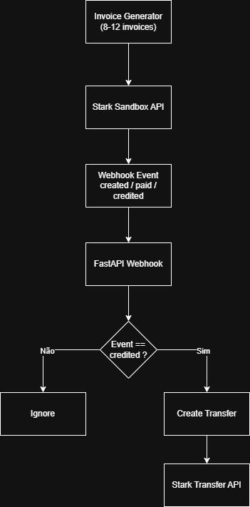

# Stark Bank Backend Challenge

Implementation developed for the **Stark Bank Backend Developer Trial**.

This project integrates with the Stark Bank API to automatically generate invoices and process webhook events to trigger transfers when invoices are credited.

---

# 🇺🇸 English Documentation

## Overview

This project was developed for the **Stark Bank Backend Developer Trial**.

The application integrates with the Stark Bank API to:

1. Generate **8 to 12 invoices** with random values and customers.
2. Receive **webhook events** from Stark Bank and automatically trigger a **transfer** when an invoice is credited.

The entire flow was built using the **Stark Bank Sandbox environment**.

---

## Technologies Used

| Technology | Version |
|-----------|--------|
| Python | 3.14 |
| FastAPI | 0.116+ |
| Stark Bank Python SDK | Latest |
| Pytest | 9+ |
| Ngrok | 3+ |
| Git | 2+ |

---

## Architecture

Application flow:

---

## Project Structure

